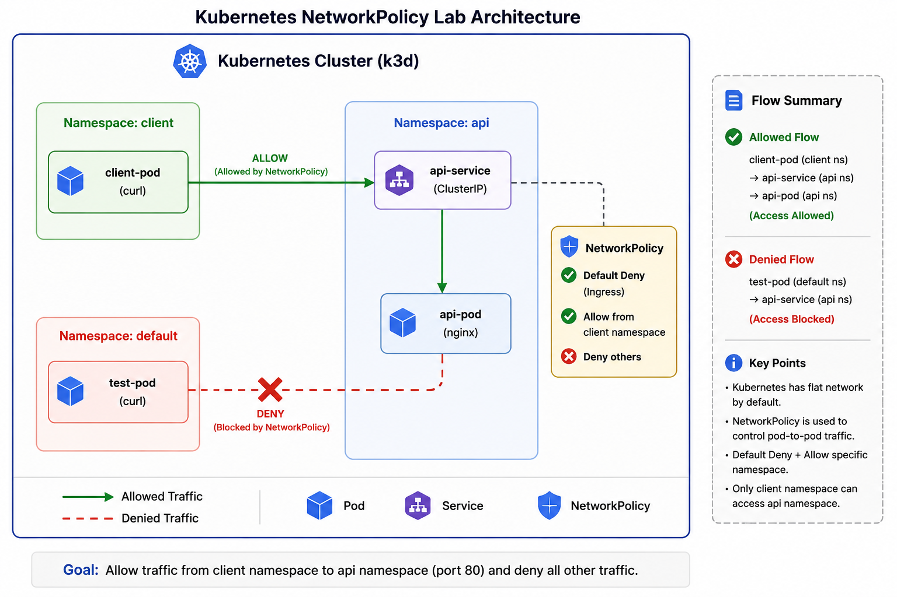
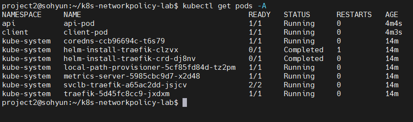
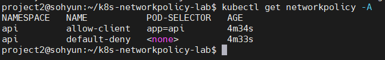
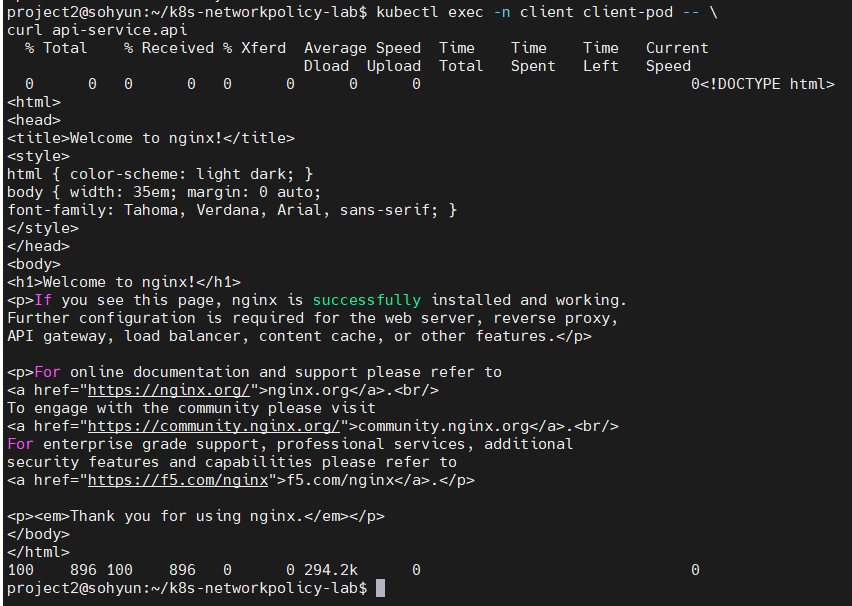
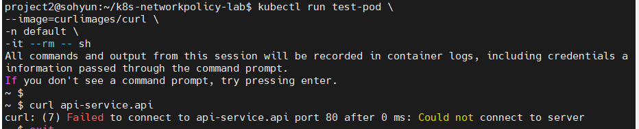

# Kubernetes NetworkPolicy 기반 최소 권한 네트워크 설계 프로젝트

> Kubernetes Pod 간 통신을 최소 권한 원칙(Least Privilege) 기반으로 제어하기 위한 NetworkPolicy 실습 프로젝트

---

## Overview

Kubernetes는 기본적으로 모든 Pod 간 통신이 가능한 **flat network 구조**를 가진다.

이러한 구조는 운영 환경에서 특정 서비스가 침해되었을 경우 **lateral movement(내부 확산)** 위험을 증가시킬 수 있다.

본 프로젝트는 Kubernetes의 `NetworkPolicy`를 활용하여 **default deny 기반 최소 권한 네트워크 구조**를 설계하고, 특정 namespace에서만 API Pod 접근을 허용하도록 구현하였다.

또한 실제 Allow / Deny 테스트를 통해 정책이 의도대로 동작하는지 검증하였다.

---

## Project Goal

### 핵심 목표

* Kubernetes Pod 네트워크 동작 원리 이해
* Pod 간 East-West Traffic 제어
* `default deny` 기반 최소 권한 네트워크 구현
* Namespace 기반 접근 제어
* Allow / Deny 트래픽 검증

---

## Tech Stack

### Kubernetes

* k3d
* Kubernetes

### Networking

* Kubernetes NetworkPolicy

### Container

* Docker

### Testing

* kubectl exec
* curl

### Documentation

* GitHub README
* Architecture Diagram

---

## Architecture

### Kubernetes NetworkPolicy Architecture



### Network Flow

#### Allowed Traffic

```text
client namespace
    ↓
api-service
    ↓
api-pod

(Access Allowed)
```

#### Denied Traffic

```text
default namespace
    ↓
api-service

(Access Blocked)
```

---

## Project Structure

```text
k8s-networkpolicy-lab/
│
├── architecture/
│   └── networkpolicy-architecture.png
│
├── manifests/
│   ├── api-pod.yaml
│   ├── api-service.yaml
│   ├── client-pod.yaml
│   ├── default-deny.yaml
│   └── allow-client.yaml
│
├── screenshots/
│   ├── allow-client-to-api.png
│   ├── deny-default-to-api.png
│   ├── networkpolicy-list.png
│   └── pods-running.png
│
└── README.md
```

---

## Kubernetes Resource Design

### Namespace

| Namespace | Purpose              |
| --------- | -------------------- |
| client    | API 호출 허용 namespace  |
| api       | API Pod 배치 namespace |
| default   | 접근 차단 검증용 namespace  |

---

### Pod Design

#### client namespace

```text
client-pod (curl)
```

* API 접근 테스트 수행
* 허용 대상 namespace

#### api namespace

```text
api-pod (nginx)
```

* API 역할 수행
* 외부 접근 제한 대상

#### default namespace

```text
test-pod (curl)
```

* 차단 검증용 pod

---

## NetworkPolicy Design

### 1. Default Deny

기본적으로 `api namespace`의 모든 ingress traffic을 차단한다.

```yaml
policyTypes:
- Ingress
```

---

### 2. Allow Specific Namespace

`client namespace`에서 오는 요청만 허용한다.

```yaml
namespaceSelector:
  matchLabels:
    name: client
```

---

## Verification

### Pod Status

정상적으로 모든 Pod가 Running 상태인지 확인하였다.

```bash
kubectl get pods -A
```



---

### NetworkPolicy Applied

적용된 NetworkPolicy를 확인하였다.

```bash
kubectl get networkpolicy -A
```



---

### Allowed Case

`client namespace`에서는 `api namespace` 접근이 가능하다.

```bash
kubectl exec -n client client-pod -- \
curl api-service.api
```

**Result:** Access Allowed



---

### Denied Case

`default namespace`에서는 `api namespace` 접근이 차단된다.

```bash
kubectl run test-pod \
--image=curlimages/curl \
-n default \
-it --rm -- sh
```

```bash
curl api-service.api
```

**Result:** Access Blocked



---

## Key Learnings

이번 프로젝트를 통해 다음 내용을 학습하였다.

### Kubernetes Networking

* Kubernetes의 기본 flat network 구조 이해
* Service DNS 기반 통신 이해
* Pod 간 East-West Traffic 이해

### Security

* Default Deny 전략
* Least Privilege 원칙
* Namespace 기반 접근 제어

### Operations

* 실제 Allow / Deny 트래픽 검증
* NetworkPolicy 적용 범위 이해

---

## Future Improvements

### v2 (Planned)

* Amazon EKS 환경에서 동일 구조 재현
* Multi-tier application 환경 적용
* Egress Policy 추가
* Pod Label 기반 세분화 정책 구성

---

## Conclusion

Kubernetes는 기본적으로 모든 Pod 간 통신이 허용되는 구조를 가진다.

본 프로젝트에서는 `NetworkPolicy`를 활용하여 **default deny 기반 최소 권한 네트워크 구조**를 설계하고, 특정 namespace만 API Pod 접근을 허용하도록 구현하였다.

이를 통해 **Kubernetes 네트워크 보안 설계 역량과 실제 정책 검증 능력**을 확인할 수 있었다.
